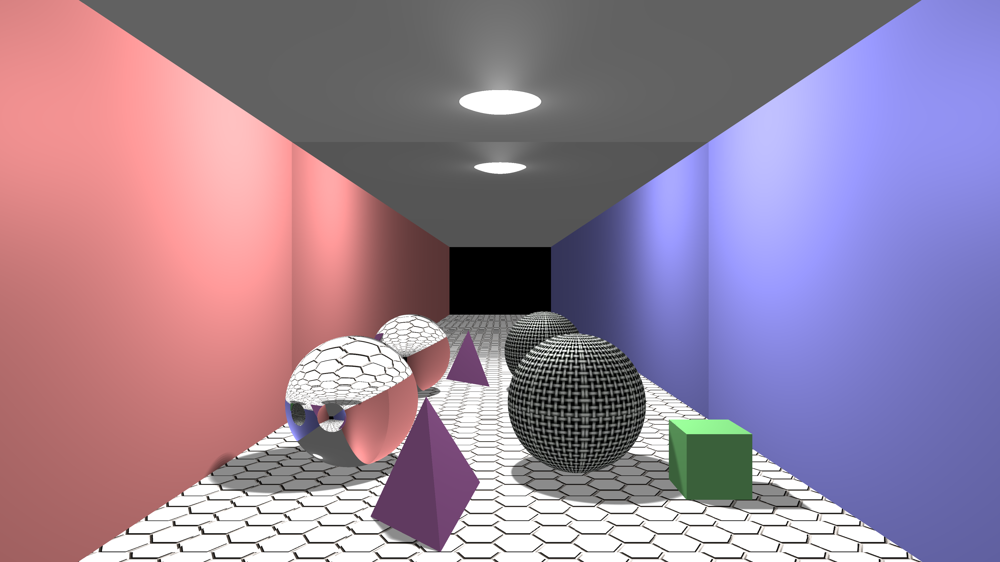

A simple ray tracing application.

Course project *for Fundamentals of Computer Graphics*.

Author: Bisheng Huang

Date: 2014.7.7

Features:

1. The demonstration of sphere, cubic, and tetrahedron.

2. Ray reflection and refractions.

3. Shadow

4. Texure for plane and sphere.

Demo: 

